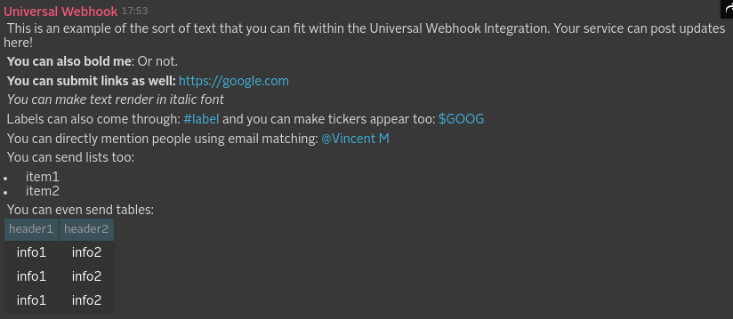

# Universal Webhook Integration
The Universal Webhook Integration enables you to send messages directly from any service into a Symphony conversation of your choice - either a 1:1 IM with you, or a room that you are the owner of.

## Run locally

1. Define your certificate paths and passwords
```
cp local-run/env.sh.sample env.sh
open env.sh
```

Make sure that
- Paths and passwords are correct
- You can reach all Symphony Pod endpoints
- Service accounts exists and cert CNs match with account's usernames
- `./env.sh`, `./application.yaml` and `./certs/` are ignored by Git and don't end up in any code repository

2. Run the integrations
```
./run.sh
```

This command will create an `application.yaml` file in the project root folder, using `local-run/application.yaml.template` as template.

## Expose local endpoint to a public host

In order to be able to create the app in the Foundation pod, you must provide a public `App Url`; you can use [ngrok](https://ngrok.com/) (or similar) to tunnel your local connection and expose it via a public DNS:
```
ngrok http 8080
```
Your local port 8080 is now accessible via `<dynamic_id>.ngrok.io`

If you have a paid subscription, you can also use
```
ngrok http -subdomain=my.static.subdomain 8080
```

Note. The team is working on a integration-provisioning module that will automate this process; until further notice, please contact Symphony Support to get your Symphony integration deployed on your pod.

## How it works
If you have a service that can be configured to send webhooks, all you have to do is point it to the URL you generate in the Universal Webhook Application available on Symphony Market, and setup your service to post webhook payloads to that URL, in messageML format.

## What formats and events it support and what it produces
Every integration will receive a message sent in a specific format (depending on the system it ingests) and will usually convert it into an "entity" before it reaches the Symphony platform. It will also, usually, identify the kind of message based on an "event" identifier, which varies based on the third-party system.

The Universal Webhook in the other hand does not support any special events, and it merely forwards the message received (if valid).
It deals with messages in the `xml` and `x-www-form-urlencode` formats.

* If you chose `xml`, you'll need to set the Content-Type to `application/xml` and submit the messageML payload in the message body.

* If you chose `x-www-form-urlencode`, you'll need to set the Content-Type to `application/x-www-form-urlencoded` and submit the messageML payload in the "payload" form field.

All messages need to be compliant with the Symphony MessageML format presented [here](https://rest-api.symphony.com/docs/message-format/)

#### What sort of message you can send through the Universal Webhook Integration
```sh
<messageML>
This is an example of the sort of text that you can fit within the Universal Webhook Integration. Your service can post updates here!<br/>

<b>You can also bold me</b>: Or not.<br/>

<b>You can submit links as well: </b><a href="https://google.com" /><br/>

<i>You can make text render in italic font</i><br/>
Labels can also come through: <hash tag="label"/> and you can make tickers appear too: <cash tag="GOOG"/><br/>

You can directly mention people using email matching: <mention email="vincent@symphony.com"/><br/>

You can send lists too:<br/>
<ul><li>item1</li><li>item2</li></ul><br/>

You can even send tables:<br/>

<table><tr><td>header1</td><td>header2</td></tr><tr><td>info1</td><td>info2</td></tr><tr><td>info1</td><td>info2</td></tr><tr><td>info1</td><td>info2</td></tr></table>
</messageML>
```

#### What it looks like when rendered in Symphony platform




# Build instructions for the Java developer

### What you’ll build
You’ll build an integration module to be used with the [Integration Bridge](https://github.com/symphonyoss/App-Integrations-Core).

If you develop a new integration, to get it up and running you'll also need to add it to the core project's web pom file.

### What you’ll need
* JDK 1.7
* Maven 3.0.5+

### Build with maven
Universal WebHook Integration is compatible with Apache Maven 3.0.5 or above. If you don’t already have Maven installed you can follow the instructions at maven.apache.org.

To start from scratch, do the following:

1. Build the _App-Integrations-Universal_ dependencies (so you have them in your Maven local repository):
> [_App-Integrations-Commons_](https://github.com/symphonyoss/App-Integrations-Commons)
2. Clone the source repository using Git: `git clone git@github.com:symphonyoss/App-Integrations-Universal.git`
3. cd into _App-Integrations-Universal_
4. Build using maven: `mvn clean install`
