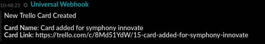
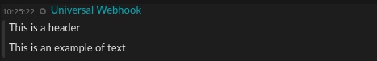
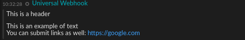

[](https://symphonyoss.atlassian.net/wiki/display/FM/Incubating)
[](https://travis-ci.org/symphonyoss/App-Integrations-Universal)
[](https://www.versioneye.com/user/projects/58d049f86893fd0037a30b1a)
[](https://scan.coverity.com/projects/symphonyoss-app-integrations-universal)
[](https://codecov.io/gh/symphonyoss/App-Integrations-Universal)


*These informations cover only Universal webhook configuration and the rendering pipeline. For more information about Webhook Integration architecture, development environment, application bootstraping and building, please visit https://github.com/symphonyoss/App-Integrations-Zapier.*

# Universal Webhook Integration
The Universal Webhook Integration enables you to send messages directly from any service into a Symphony conversation of your choice - either a 1:1 IM with you, or a room that you are the owner of.

## How it works
If you have a service that can be configured to send webhooks, all you have to do is point it to the URL you generate in the Universal Webhook Application available on Symphony Market, and setup your service to post webhook payloads to that URL, in messageML format.

## What formats and events it support and what it produces
Every integration will receive a message sent in a specific format (depending on the system it ingests) and will usually convert it into a Symphony MessageML before it reaches the Symphony platform. It will also, usually, identify the kind of message based on an "event" identifier, which varies based on the third-party system.

The Universal Webhook on the other hand does not support any special events, and it merely forwards the message received (if valid). You can send in either messageMLv2 content, or legacy messageMLv1 content.

#### How to send messages into Symphony using the universal webhook

The Universal Webhook Integration can accept MessageMLv2 or legacy MessageMLv1.

It deals with messages in the `xml`, `x-www-form-urlencode`, and `form-data` formats.

To send messages using messageMLv2 you can use the following technique:

* Send your payload as `form-data`. You'll need to set the Content-Type to `multipart/form-data` and submit the messageML v2
template in the "message" form field and the Entity JSON in the "data" form field. This option is only available when
 the Integration Bridge posts messages through the Agent that has version equal or greater than '1.46.0'
 
Your message will need to be compliant with Symphony [MessageML v2](https://symphonyoss.atlassian.net/wiki/display/WGFOS/MessageML+V2+Draft+Proposal+-+For+Discussion)
 
Here is an example of a message sent through the Universal Webhook, that looks like a Zapier card. You can customize the MessageMLv2 and Entity JSON to your liking, as long as it is valid, it will be passed through and rendered.
 
* This is the messageML v2 that the Universal Webhook integration received, which defines the layout of the card and how the front end will render it within Symphony:

```xml
<messageML>
    <div class="entity" data-entity-id="zapierPostMessage">
        <card class="barStyle">
            <header>        
	      <span>${entity['zapierPostMessage'].message.header}</span>
            </header>
            <body>
              <span>${entity['zapierPostMessage'].message.body}</span>    
            </body>
        </card>
    </div>
</messageML>
```
* This is the EntityJSON that the Universal Webhook integration received after parsing, which defines the content of the card that the front-end will use in combination with the MessageML v2 to render the card:

```json
{
	"zapierPostMessage": {
		"type": "com.symphony.integration.zapier.event.v2.postMessage",
		"version": "1.0",
		"message" : {
		    "type": "com.symphony.integration.zapier.event.message",
		    "version": "1.0",
		    "header": "New Trello Card Created",
		    "body": "Card Name: Card added for symphony innovate<br/>Card Link: https://trello.com/c/8Md51YdW/15-card-added-for-symphony-innovate"
		}
	}
}
```
When rendered, the above MessageML v2 example will appear like so:



To send legacy messages using MessageMLV1 you can use the following techniques:

* If you chose `xml`, you'll need to set the Content-Type to `application/xml` and submit the messageML payload in the message body.

* If you chose `x-www-form-urlencode`, you'll need to set the Content-Type to `application/x-www-form-urlencoded` and submit the messageML payload in the "payload" form field.

Your message will need to be compliant with Symphony [MessageML v1](https://rest-api.symphony.com/docs/message-format/)

# Testing with Postman
[Postman](http://getpostman.com) is an application that makes it easy to test HTTP requests.
Both MessageMLv1 and MessageMLv2 uses these common three steps:

1. Download and install Postman.
2. Copy and paste your webhook URL into Postman
3. Change the HTTP method to POST

## Testing with MessageMLv1

1. Click Body then select raw.
2. Compose a messageML document in the body of the HTTP request. You can use the code samples below for pre-formatted messages.
3. Click Send.

```sh
<messageML>
This is an example of the sort of text that you can fit within the Universal Webhook Integration. Your service can post updates here!<br/>

<b>You can also bold me</b>: Or not.<br/>

<b>You can submit links as well: </b><a href="https://google.com" /><br/>

<i>You can make text render in italic font</i><br/>
Labels can also come through: <hash tag="label"/> and you can make tickers appear too: <cash tag="GOOG"/><br/>

You can directly mention people using email matching: <mention email="vincent@symphony.com"/><br/>

You can send lists too:<br/>
<ul><li>item1</li><li>item2</li></ul><br/>

You can even send tables:<br/>

<table><tr><td>header1</td><td>header2</td></tr><tr><td>info1</td><td>info2</td></tr><tr><td>info1</td><td>info2</td></tr><tr><td>info1</td><td>info2</td></tr></table>
</messageML>
```
When rendered, the above MessageML v1 example will appear like so:


## Testing with MessageMLv2

1. Click Body then select form-data.
2. Add a key named "data" with the following value:
   
   ```sh
   {
        "testMessage": {
          "type": "com.symphony.integration.test.event",
          "version": "1.0",
          "message": {
            "type": "com.symphony.integration.test.message",
            "version": "1.0",
            "header": "This is a header",
            "body": "This is an example of text"
          }
        }
      }
   ```

3. Add a key named "message" with the following value:    
   
   ```sh
    <messageML>
        <div class="entity" data-entity-id="testMessage">
            <card class="barStyle">
                <header>
                    <span>${entity['testMessage'].message.header}</span>
                </header>
                <#if (entity['testMessage'].message.body)??>
                    <body>
                        <div class="labelBackground badge">
                            <span>${entity['testMessage'].message.body}</span>
                        </div>
                    </body>
                </#if>
            </card>
        </div>
    </messageML>
   ```
   
4. Hit Send

When rendered, the above MessageML v2 example will appear like so:


   
   Note that the body field on the data may contain the same tags as the MessageMLv1 with the exception of:
   * Links
   * Mentions
   * Labels
   
   To use those features, their tags must be included on the message key inside the body tag, like the following example:
   
      
       <messageML>
           <div class="entity" data-entity-id="testMessage">
               <card class="barStyle">
                   <header>
                       <span>${entity['testMessage'].message.header}</span>
                   </header>
                   <#if (entity['testMessage'].message.body)??>
                       <body>
                           <div class="labelBackground badge">
                               <span>${entity['testMessage'].message.body}</span>
                               You can submit links as well: <a href="https://google.com" /><br/>
                           </div>
                       </body>
                   </#if>
               </card>
           </div>
       </messageML>
       
When rendered, the above example will appear like so:       
   


     
   